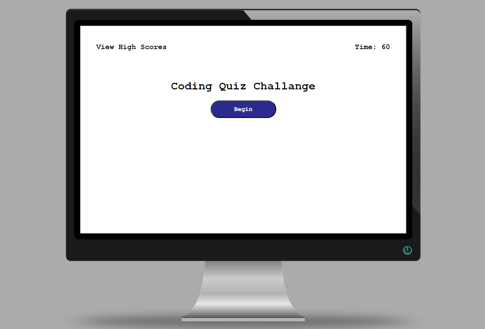
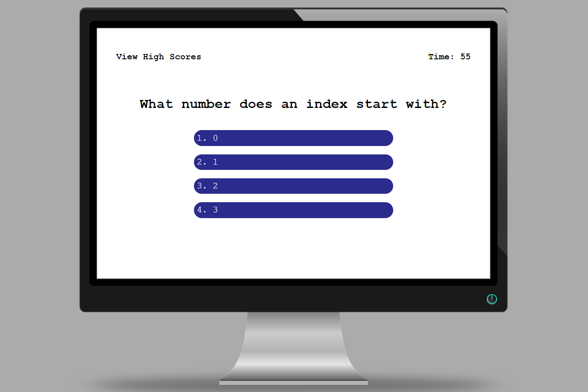
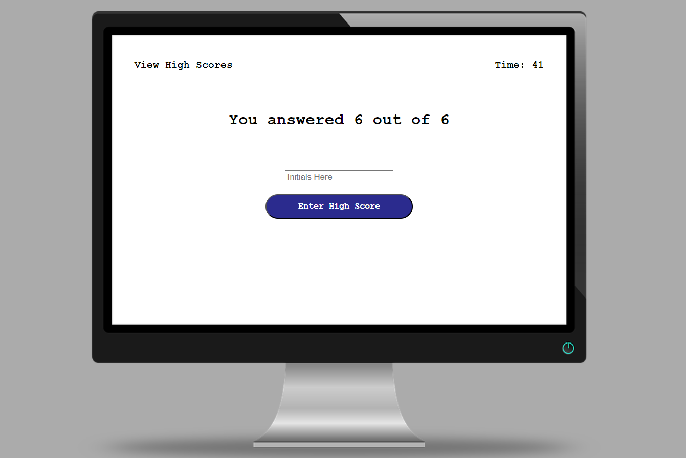
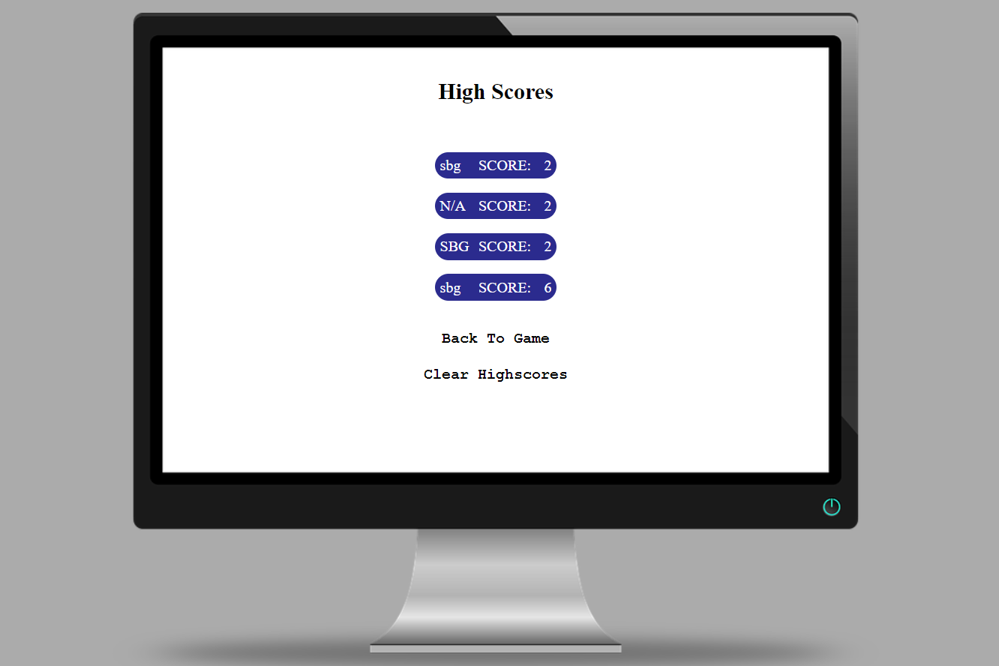

# green-quiz-time

## Discription 

This project was to creat a quiz with a start button. When the start button is clicked questions would appear with a timer counting down and reducing with every wrong answer. When the question are completed the user is given a input field to put there initials. The initials and score ar then logged to a highscore screen. 

## Mock-up

## Deployment Links

deploy - https://mrgreen12375.github.io/green-quiz-time/

GitHub repo - https://github.com/mrgreen12375/green-quiz-time